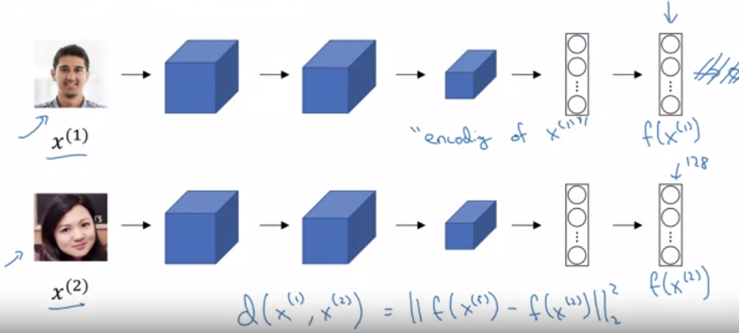
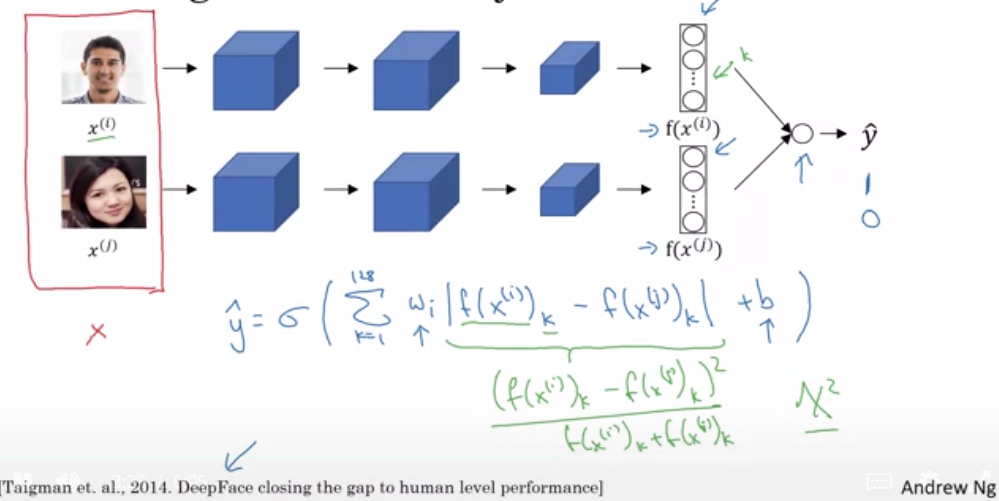
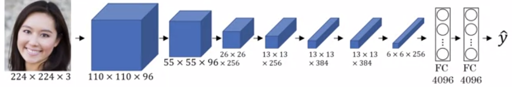
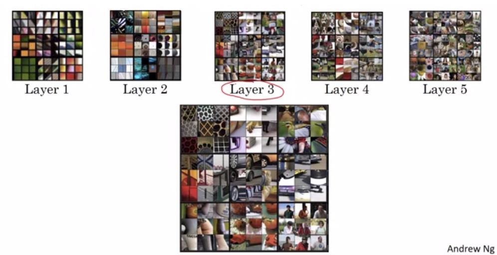
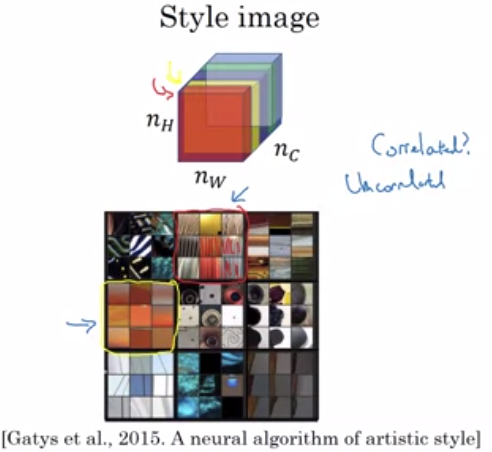

# Face Recognition

* Face Verification: Has an input image with a paired ID. The network must decide if the image matches the ID

* Face Recognition: Has an input image and a database of K persons. Must output the ID for who the image is of, or 'not recognised'.

We begin building a face verification system, then will implement it as a recognition system if it is good enough

## One Shot Learning

For a face-recognitions system to work, You need to be able to recognise a person given only 1 example of their face. Think of taking a photo ID, and then deciding if the person you're looking at is the same person as in the ID. 

This could be solved by having a final softmax layer with say 5 outputs if there are 4 people in your verification system (and 1 output for unknown). But if you need to add a person to your network, you'd need to retrain the entire thing to have an output with 6 layers.

Thus, instead of building a model that predicts 'Are you person X', you rather build a model that takes in 2 images and outputs how similar the people in the 2 images look. This solves expanding your system to include more people.
So, you want to learn a similarity function. $d(img1,img2)$ which outputs a small value if it is the same person, and a large value otherwise. Then, at Recognition time, We compare the image to all the images in the database, and output the ID the new image is most similar to. 

## Siamese Network

To learn this function $d()$, we will use a Siamese Network.

The idea is to take your database images, and to use a network to compress it to some smaller representation. Then using the same network, compress your input images to the same representation, and then to calculate the distance between the representations at this level - perhaps using an L2-norm. 

So we want to learn parameters such that if 2 images are the same, the the L2-norm is small, but if they are different people, the L2-norm is large.

To learn these parameters, we will make use of Triplet Loss

## Triplet Loss

To train using triplet loss, you need an 'Anchor' image (stored in database), a Positive image (of the same person), a Negative image (of a different person, but who looks quite similar)

Then we want $||f(A) - f(P)||^2 \leq ||f(A) - f(N)||^2 + \alpha$. where $f()$ denotes the compressed-representation of the network. The $\alpha$ is added to the above condition to stop the network from finding a trivial solution such as always outputting a constant value. 

It takes lots of examples to get this correct - commercial systems are trained on very large datasets (more than 1 million images). Again, using pretrained models is probably the best approach.

## Face Verification as a binary classification problem

Rather than using triplet loss, one can also treat facial recognition as a binary-classification problem. In this case, you still have a siamese network calculating some representation of your 2 images, but then you have a final softmax-layer that computes an activation on the differences between these 2 representations and outputs either a 1 or 0 if they are of the same person. Your training set would now be just pairs of images rather than triplets. It's not clear what the benefit of either approach is to me.

#Neural Style Transfer

[Example of Neural Style Transfer](CNN-Neural Style Transfer Example.PNG)

Problem statement: Given a content image and a style image, we want to generate a new picture of the content image, but in the style of the style image. The example given is to create a picture of some building that looks like a Van Gogh painting (so Starry Night is the style image).

##What are ConvNets learning

To visualise what it is that your convolutional network is learning, you can go through your training data-set and pick out the regions of your image that maximally activate a node in your network. Remember, nodes in the first layer of your network will have only seen small regions of your image at a time, then as you go deeper, the nodes will have been exposed to larger regions of the image.

In the image below, The 9 best examples are shown that maximally activate some nodes in various layers of the network. In the early layers, you're detecting basic shapes, but as we go deeper, we can see there are some nodes that respond strongly to the wheels of a car, or to specific dog-breeds etc.

We will use this intuition to build the Neural Style transfer.

##Cost function

We create cost function $J(G) = \alpha J_{\text{content}}(C,G) + \beta J_{\text{style}}(S,G)$. The original paper used 2 parameters ($\alpha$,$\beta$) to parameterise this and we do the same even though it seems we could get away with 1. 

###Generating the new image

* initialise the generated image randomly, G: $100 \times 100 \times 3$. G would now just be white noise.
* Use Gradient descent to minimize $J(G)$. As you step through this process, G will closer represent the desired image.

###Content Cost Function

We calculate the content cost on some chosen layer in the network. If we choose a layer that is very shallow, it will force your generated values to be very close to the pixel values. If it's too deep, it may get too abstract - in particular positionally. So if there's a dog in your input image, it will put a dog somewhere in your resultant image, but not necesarily in the same place, since positional information gets lost further down the network

* Choose a hidden image layer $l$
* Use a pre-trained ConvNet (Eg. VGG network)
* Measure how similar your content and generated images are in content, by comparing the activation of layer $l$ in both images
* so $J_{\text{content}}(C,G) = ||a^{[l][C]}-a^{[l][G]}||^2$

Ensuring these layers are similar enough ensures that they contain similar content

###Style Cost Function

Style is defined as the *correlation* between activations across channels.

Why does *style* get treated as correlation?

Suppose one channel of activations is detecting vertical lines in an image, and a second channel is detecting orange-coloured patches. If these channels are highly correlated, it means that when we see vertical lines, we should also see orange patches. If we force this correlation onto our content image, it should transform a picture of a building to be more orange if that is how buildings are typically coloured in our style image. So the degree of correlation between channels gives a measure of style.

So we create a style matrix as follows:

* Let $a_{i,j,k}^{[l]}$ denote the activation at $(i,j,k)$ (representing height, width and channel respectively) for layer $l$. 
* Then we calculate $G^{[l]}$ as an $n_c^{[l]}\times n_c^{[l]}$ matrix where $ n_c^{[l]}$ denotes the number of channels in layer $l$.
* Then calculate $G_{k,k'} = \sum_{\forall i} \sum_{\forall j} a_{i,j,k}^{[l]} a_{i,j,k'}^{[l]}$ for each $(k,k')$ pair for both the Style image and the Generated image
* Then $J^{[l]}_{\text{style}}(S,G) = ||G^{[l](S)}-G^{[l](G)}||^2_F$ denoting the Frobenius norm (so take elementwise differences)
* But, while content is calculated on a single layer, we will use style cost across multiple layers, so
*  $J_{\text{style}}(S,G) = \sum_l \lambda^{[l]}J^{[l]}_{\text{style}}(S,G)$

#1D and 3D generalizations

The point here is simply that Convnets can be used in other dimensions as well, even though in 1D most commonly Recurrent Neural Networks are used.
