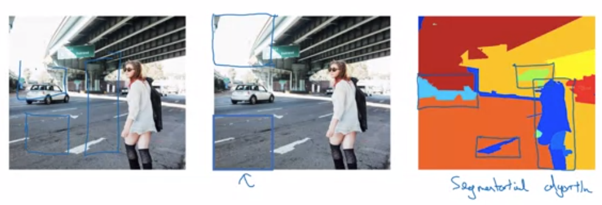

# Object Localization

**Goal:** Predict what type of object is in an image, and draw a bounding box around the object in the image

**Input Data:**

The input data needs to have the bounding boxes already provided, and a classification label

**Output Format:**

Suppose you are trying to predict whether an image contains any of 3 different objects (car, pedestrian, motorcycle) or if it is just background. Your output vector will have the following elements:

* $p_c$: the probability that the image contains an object (regardless of object type)
* $c_1, \dots, c_3$ the probability that the object is of class $i$ given that there is an object in the image.
* $b_x,b_y,b_h,b_w$ denoting $(x,y)$ coordinates for the box as well as height and width.
* Note that it's using the common decomposition: $P(car) = P(object)*P(car|object)$.
* Loss function: If there is an object in an image, your loss function should take squared error of each element in your output as normal. However, if the image is just background, you don't care about the values for any element besides $p_c$, so you only penalise on that value. 

# Object Detection

## Sliding window algorithm

First train a model with closely cropped pictures of cars. This gives you a car-detection network. Then on a larger image, run a sliding window across the image until you find a car. Then run a slightly larger window through the image. then a slightly larger window and so on. 

The disadvantage of this is computationality since you have to run many windows through your network for each image. So typically it was used with simpler algorithms.

Fortunately, sliding windows algorithm can be implemented convolutionally for performance gains with CNN

## Convolutional Implementation of Sliding Windows Algorithm

Before we show the implementation of sliding windows using convolutions, we first introduce a trick to represent fully connected layers as convolutions. Usually to get to a fully-connected layer, a previous layer is just 'flattened out' without transformation. But instead, in the image above,  400 5x5 (by 16) filters can be used instead, the fully connected layers are turned into 1x1x400 convolutional layers. Note the result isn't the exact same as just reshaping - its some linear transformation of those nodes. But since the these nodes are all then just put into a linear function anyway before being transformed its a meaningless difference. 

Representing our neural network using convolutions as shown above means we can implement a sliding window algorithm in a single forward pass of the network as in the second image above. The conv-layers inside your network share information quite well, (for example, the red and the green squares in the second example share most of the nodes in the internal representations), and the layers that replaced the fully connected layers now just become wider to contain the output for each sliding window. Note the Max-Pool layer of size 2 means the effective window stride-size is size 2 as well. 

# YOLO Algorithm

## Bounding Box Predictions

Many windows will contain parts of the car. As part of YOLO, we split the larger image into a grid of say, 9 smaller cells (3x3). In practice you'd choose a small enough grain to try guarantee 1 object per cell - say 19x19.

* Split your image into 3x3 cells (or whatever value)

* Each object is assigned to the cell which contains its centerpoint

* Each grid has labels $(p_c, b_x, b_y, b_h, b_w, c_1, c_2, c_3)$ (assuming 3 different object types)

* Output layer has dimension $ 3 \times 3 \times 8$

Runs very fast since it's a convolutional algorithm - even for realtime object detection.

## Intersection Over Union

To figure out if overlapping boxes are identifying the same object or just an overlapping object, we calculate $IoU=\frac{A \cap B}{A\cup B} = \frac{Area(A\cap B)}{Area(A) + Area(B) - Area(A\cap B)}$

If the IoU is greater than say 0.5, then we assume it is the same object. The details are shown in the non-max Suppression description

## Non-max Suppression

If we use a fine mesh for YOLO, it helps guarantee that each grid-cell will contain only 1 centerpoint of an object. However many cells will contain some part of the object and, at implementation, we will have many adjacent cells detecting the same car. We need to reduce this to only keep the cell that is most confident that it contains a car. We map out the process here

* First, discard all boxes with $p_c \leq 0.6$

While there are overlapping boxes

* Pick box with largest $p_c$. Output this as a prediction

* Discard remaining boxes wuth $IoU \geq 0.5$ with the box in the previous step

Note - only do nonmax suppression when the boxes think it's the same object. If there is a pedestrian in front of a car, we should leave them be.

## Anchor boxes

There are 2 ways to motivate for anchor boxes

1. One of the problems with YOLO as described so far, is that each grid can only handle 1 object in it since it's parameterisation doesn't have space for more. Anchor boxes would allow multiple objects with centers in the same grid-cell.

2. It allows aspects of your model to specialise - if pedestrians tend to be tall, and cars tend to be wide, then using anchor boxes will allow your model to have aspects that are 'car-focussed' and 'pedestrian-focussed'.

In practice, point 1 doesn't happen too often since you could just choose a finer mesh, but point 2 is nice since the features you'd look for to identify a car are quite different to the features you'd use to identify a person

The idea is that you double (or triple or whatever) the length of your labels for a grid so that you can store multiple objects of data into the same grid. Then, you follow a convention of 'tall skinny objects go into the first position', and 'shorter wider objects go into the second position'. See the example above. 

## Putting it all together - the complete YOLO algorithm

Above is an example of what your training inputs would look like - incorporating Anchor boxes, and the grid for YOLO. Then, when making predicitons, we would also implement non-max suppression to deal with adjacent/overlapping boxes.

# Region Proposals

This is an alternative to YOLO, but not as well used I don't think.

This paper proposed R-CNN (regions with CNNs) and this tries to choose just a few regions to run your CNN on rather than on all windows (as done with CNNs).

This breaks your object identification into 2 steps - first find regions on which to run the CNN, then run the CNN whereas YOLO is just 1 step by just running the CNN everywhere.

