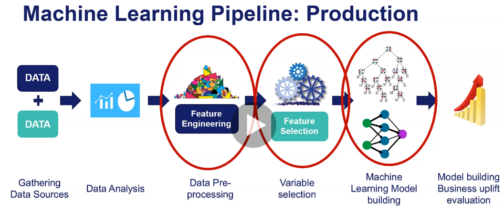
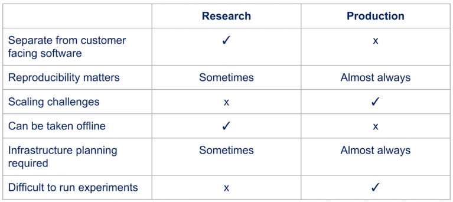

# Section 2

# Section 3

Machine learning in production requires multiple different components in order to work. 'Architecture' describes the way software components are arranged and the interactions between them.

### Specific Challenges of ML Systems

* Need for reproducibility
* Entanglement - changing 1 input feature could change all weights. Changing anything changes everything
* Data dependencies - Traditional software only has a code dependency. We have a data dependency as well, and data inputs can be unstable
* Configuration issues - not clear, but seems to relate to hyperparameter decisions perhaps 
* Data and feature preparation - systems can have massive amounts of supporting code to prepare data (think TFG online model)
* Model errors can be hard to detect with traditional tests
* Separation of expertise - because deploying a model requires so many people, its possible everyone just blindly does their role and no one understands the entire process.

### Key Principles for ML System Architecture

* Reproducibility: Have the ability to replicate a given ML prediction
* Automation: Retrain, update, deploy models as part of an automated pipeline
* Extensibility: Have the ability to easily add and update models
* Modularity: Preprocessing/feature engineering code used in training should be organised into clear pipelines
* Scalability: Ability to serve model predictions to large numbers of customers
* Testing: Test variation between model versions

### General ML Architectures

1. Train by batch, predict on the fly, serve via REST API
2. Train by batch, predict by batch, serve via shared database (TFG Online)
3. Train, predict by streaming
4. Train by batch, predict on mobile (or other client)

![Architecture Comparison] (./S2 - ML Architectures.PNG)

###Architecture breakdown for train by batch, predict on the fly

Architecture can be broken up into multiple layers:

1. Data Layer
2. Feature Layer
3. Scoring Layer
4. Evaluation Layer: checks equivalence of 2 models - eg actual vs predicted.

