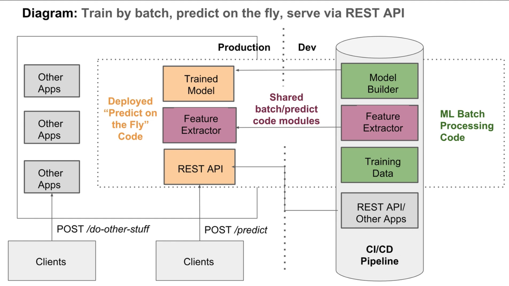

# Section 2: ML Pipeline - Research Environment

# Section 3: ML System Architecture

Machine learning in production requires multiple different components in order to work. 'Architecture' describes the way software components are arranged and the interactions between them.

### Specific Challenges of ML Systems

* Need for reproducibility
* Entanglement - changing 1 input feature could change all weights. Changing anything changes everything
* Data dependencies - Traditional software only has a code dependency. We have a data dependency as well, and data inputs can be unstable
* Configuration issues - not clear, but seems to relate to hyperparameter decisions perhaps 
* Data and feature preparation - systems can have massive amounts of supporting code to prepare data (think TFG online model)
* Model errors can be hard to detect with traditional tests
* Separation of expertise - because deploying a model requires so many people, its possible everyone just blindly does their role and no one understands the entire process.

### Key Principles for ML System Architecture

* Reproducibility: Have the ability to replicate a given ML prediction
* Automation: Retrain, update, deploy models as part of an automated pipeline
* Extensibility: Have the ability to easily add and update models
* Modularity: Preprocessing/feature engineering code used in training should be organised into clear pipelines
* Scalability: Ability to serve model predictions to large numbers of customers
* Testing: Test variation between model versions

### General ML Architectures

1. Train by batch, predict on the fly, serve via REST API (focus for this course)
2. Train by batch, predict by batch, serve via shared database (TFG Online)
3. Train, predict by streaming
4. Train by batch, predict on mobile (or other client)

![Architecture Comparison] (./S2 - ML Architectures.PNG)

### Architecture breakdown for train by batch, predict on the fly

The steps our system architecture needs to take can be broken up into multiple layers:

1. __Data Layer__: provide access to all data sources
2. __Feature Layer__: generate features in transparent, reusable and scalable way
3. __Scoring Layer__: transform features into predictions
4. __Evaluation Layer__: checks equivalence of 2 models - eg actual vs predicted

### Building a Reproducible ML Pipeline

We need to guarantee the entire pipeline is reproducible so that a model and its predictions can be replicated exactly. This requires reproducibility in the following steps.

__Input data__

* Save a snapshot of training data if possible (may break data practice rules). Otherwise design data sources with accurate timestamps so that a view of the data at a point in time can be retrieved

* SQL may return results in different order - it may be important to keep track of training vs testing sets used.

__Feature Engineering__

* Code to generate features should be tracked properly with version control and published with auto-incremented or timestamp hashed versions (not sure I understand how to auto-increment to track which version of a function is used).
* Sample means used for normalisation/imputation should be stored.
* If randomly imputing, remember to set a seed.

__Model Building__

* Record the order of features
* Record feature transformations (log, standardisation, etc)
* Record hyperparameters
* Set seed if model has a random element
* if the final model is an ensemble, record the ensemble structure

__Model Deployment__

* Software versions should match exactly - list libraries and their versions.
* Use a container and track its specifications (such as image version)
* Research, develop and deploy utilising the same language. (Don't build in R, deploy in Python)
* Make sure model integration is understood before deployment and develop with this is mind
  - avoid using features not available when the model is live
  - watch out for live-population being different from training-population.
  
# Section 4: Pipeline - Writing Production Code

### Overview

We need to write production code for the 3 steps circled in red in section 2. Namely, Preprocession, Variable Selection, and Model Building. We typically need to move from Notebooks into Scripts.

Deployment code can be written in 3 main ways:

* __Procedural Programming__: Write a sequence of functions as in Jupyter

The other ways use Object-Oriented Programming

* __Customer Pipeline__: Calls procedures in order
* __Third-party Pipeline__: eg. Sci-kit learn pipeline

### Procedural Programming

Procedural programming involves writing procedures/functions/etc that can be called in a specific order. This is what I have done so far. It's not recommended inTypically involves the following:

* A yaml file containing user-defined constants (paths to data or models, column-means used for normalisation, features required in data)
* Script containing processing function definitions
* Control script that is executed and runs all functions in the correct order

__Advantages__:

* Straightforward to create after notebooks
* No software development skills required
* Easy to manually check if it reproduces the original model

__Disadvantages__:

* Can get buggy
* Difficult to test
* Difficult to build software on top of it
* Need to save a lot of intermediate files to store the transformation parameters