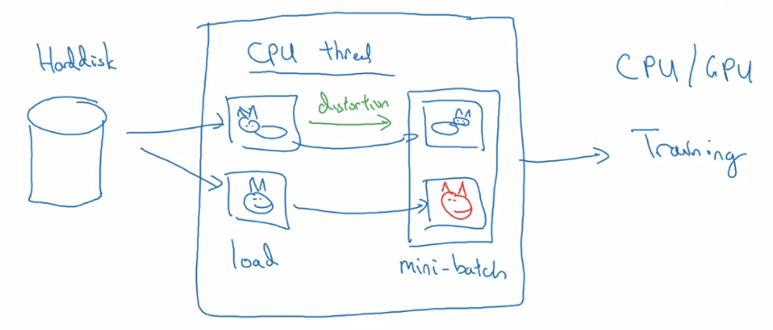

```{r, include=FALSE}
library(hwriter)
library(knitr)
library(dplyr)
library(kableExtra)
```

#Use Open-Source Implementations

A lot of interesting Neural Nets from research papers will have their implementations available on github. Read papers, download the network! For example ResNet is on Github.

Downloading a pretrained network can often be the fastest way to get started on a project.

#Transfer Learning

It's possible to download an already built network, then only to remove the very last layer, and train the network to your specific task

##Freezing layers

In transfer learning, you can freeze the parameters in a network so that they aren't learnable. Then the training will only teach the final softmax layer or whatever that you've added in.

If you have a larger labelled dataset, you can freeze fewer layers in the prebuilt network, and train more of the layers. You always freeze the first few layers, then train the last few. 

The pattern is that if you have more data, you unfreeze more parameters.

##Use an existing network just as an initialisation

If you have a huge dataset, you may just use a preexisting trained network as initialised weights for your task, then you would train everything.


#Data Augmentation



Most vision tasks could use more data. So data augmentation creates that data from existing data.

Vision-models tends to always benefit from more data.

* Mirroring
* Random Cropping - randomly choose parts of the image (although you may accidentally choose a part that isn't really a cat)
* Rotaion
* Sheering
* Local warping
* Colour-shifting (make more red, more green, more blue image by adding some ammount to each channel)
    
    - Many methods to sample from colour augmentations -  one of which is called "PCA color augmentation"

* Distortions will often be done on the CPU thread when creating a mini-batch. So the particular distortions trained on are never saved.

#State of Computer Vision

There are some things unique about deep learning for computer vision.

* It still feels like we need more data for a lot of problems, even though some datasets are quite big

* With smaller datasets comes more hand-engineering, and complex hyperparameter choices and stuff.

__Tips for doing well on benchmarks/winning competitions__

* Ensembling: Train multiple independent networks, then average their outputs. Good for benchmarks, but bad in production systems since its slow. Also takes memory to hold all those networks
* Multi-crop at test-time. 
    - For example 10-crop takes a central crop of an image and 1 crop from each corner, then does the same on the mirror image.
* Use open-source code
* Use pretrained models and fine-tune on your dataset
