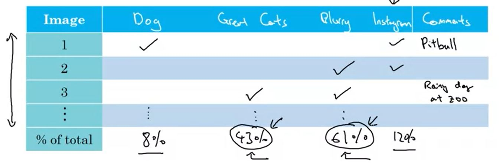
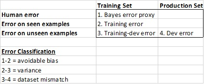

# Error Analysis

## Carrying out error analysis

If you're doing a classification task, go through 100 incorrectly predicted images and look for common trends using a table formatted as below. Use this to decide on the direction of improvement for your model. It's no good expending effort to improve prediction against dogs if this only accounts for a small percentage of your errors.

## Cleaning up incorrectly labeled data

If your training data has incorrectly labelled data, what should you do?

* It turns out DL algorithms are quite robust to *random errors* in the training set.
* But Systematic Errors will often be an issue.

What if your Dev set has incorrectly labelled data? This leads to an incorrect error rate. Only go through and correct the labels in your dev set if it affects your ability to rank different models. When creating the error table as in the previous section, make a column for 'incorrectly labelled' examples. Based on the relative occurence of incorrect labels versus other issues, make the decision of whether it's worth correcting.

* If you fix something in your dev set, make sure to apply it to your test set as well to ensure the same distribution (training set not necessary)

* Train and dev/test sets may now come from slightly different distributions. This is okay. But the Dev/Test distributions must always match

* Consider examining examples your algorithm correctly predicted the label as well. There may be examples of dogs labelled as cats there too.

## Build your first system quickly, then iterate

Not much to add here than the title

# Mismatched training and dev/test set

## Training & Testing on different distributions

Say you have 200k pictures of cats from the internet, and only 10k examples from your actual application. How do you split between train/test/dev?

According to Ng, ideally all 200k from the alternate source go into training. The test/dev sets should only be from the actual end use-case. It's optional to allow say 5k of the app-examples into training set too.

Personally I think it may be useful to keep 5k of the internet pictures aside for a separate train/test set. Wouldn't this be helpful for figuring out if your model is overfitting to the training set? Edit: This is exactly what is recommended in the next video.

## Bias and Variance with mismatched data distributions

Assume we build a model with mismatched data and the following errors:

* Human error $\approx$ 0
* Training error = 1%
* Dev error = 10%

For matching distributions, this would imply a low-bias high-variance problem. But when the distributions are different it's hard to say - maybe the training set was easier (higher res for example).

The problem here is 2 things changed when we moved to the dev set.

1. Algorithm saw the data in the training set
2. The distribution changed

To separate out the source of error, we create a Training-dev set which is the same distribution as the training set, but not used for training.

So now we would have the information

* Human error $\approx$ 0
* Training error = 1%
* Training-dev error = 9%
* Dev error = 10%

From this, it is clear most of the error came from the NN training on examples it hasn't seen before, rather than because of the change in distribution. Therefore we have a high-bias problem. If the Training-dev error had been say 2%, then it would be a distributional issue.

It can be useful to get error measures on the missing elements in the above table (particularly human error), however it is usually quite inconvenient to do so.

## Addressing data mismatch

There aren't completely systematic solutions to this, but there are some things one can try.

For example:

* Carry out manual error analysis to try to understand difference between training and dev/test sets

* Try to make training data more similar, or collect more data similar to dev/test sets (eg - simulate car-noise in background of training data)

# Learning from multiple tasks

## Transfer learning

Transfer learning refers to training a model on one task, then replacing the last layer and retraining the model for the new task. This either involves fixing all weights except the last layer, or allowing all weights to be retrained depending how much data you have.

It's also viable to replace the last layer with several layers if the new task is more complex. 

Transfer learning makes sense when:

* Task A and B have the same input X (eg - images, audio)
* You have a lot more data for Task A than Task B
* Low-level features for Task A could be useful for Task B

## Multi-task learning

Instead of learning task A then transferring this knowledge to task B, you learn tasks A and B simultaneously.

For example, each image would have multiple binary labels - for example an 4x1 binary vector indicating whether the following are present in an image: (pedestrian, car, stop sign, traffic light).

Note that it is still possible to use images even if they haven't been classified for all labels (eg - if you don't have a label for stop sign, but do for pedestrian and car, its okay).

Multi-task learning makes sense when:

* Training on a set of tasks that could benefit from having shared lower-level features
* Usually, amount of data you have for each task is quite similar
* Can train a big enough neural network to do well on all the tasks

# End-to-end deep learning

## What is end-to-end deep learning

Example 1: audio-scripting.

Imagine the task of transcribing an audio clip. Typically this would involve

audio-clip -> extract features -> phonemes -> words -> transcript.

E2E deep learning skips this whole process by just building a big neural network that goes straight from audio-clip to written text. This does however require a very large training dataset.

Example 2: Face recognition.

Imagine the task of a turnstyle using facial recognition to open for specific people.

Traditional approach:
Image -> Draw bounding box around face -> is this face in our database.

E2E approach:
Image -> Is this person in our database.

It turns out in this case that separating out the tasks into finding the face then passing this through to the face-recognition system works much better than passing an entire image, since the variance in the image can be too high.

So End-to-end deep learning is a method that is not always best.

## Whether to use end-to-end deep learning

Pros:

* Let the data speak - the model can figure out what is and isn't important. For example, in language it may not be best to learn phonemes to transcribe. Rather than forcing your model to use a specific data representation, E2E allows it to figure out what's best.
* Less hand-designing of components needed

Cons:

* May need large amount of data
* Excludes potentially useful hand-designed features

Key Question: Do you have sufficient data to learn a function of the complexity needed to map x to y

